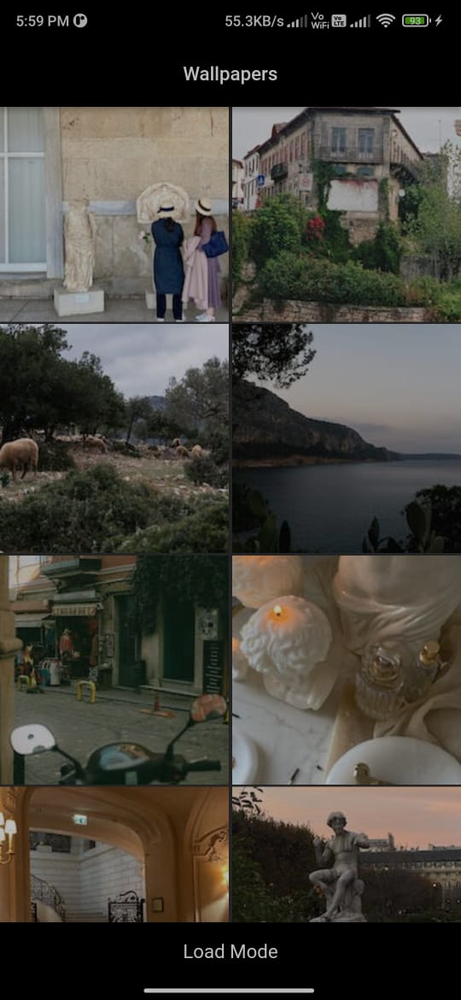
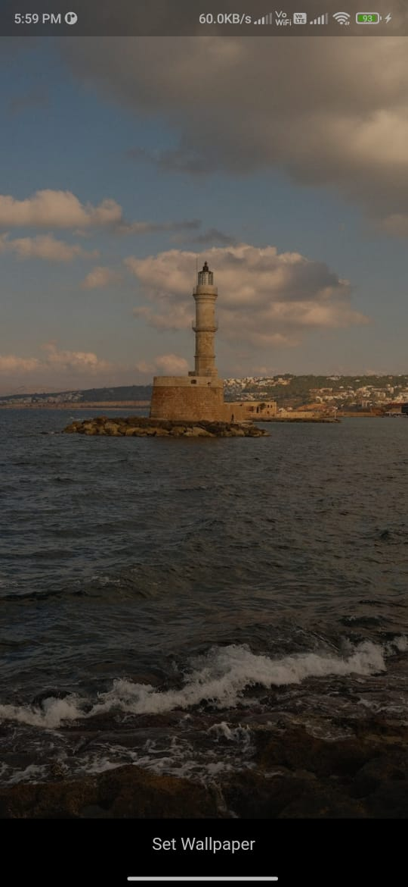
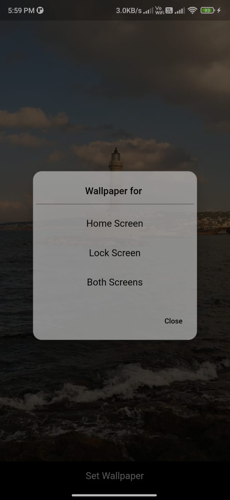

# Wallpaper_App_using_PixelsApi

Wallpaper App where the images are loaded dynamically by the help of Pixels API
It has 2 different screens & one dialog screen where you can set wallpapers for home screen, lock screen or for both the screens.
it can load 80 images at a time.. also after clicking the loadmore button it loads 80 more images.

  <h3> Home Screen of Wallpaper Page</h3>
  

  <h3> FullScreen view of Selected Image</h3>
  

  <h3> Screen type</h3>
  

## Getting Started

This project is a starting point for a Flutter application.

A few resources to get you started if this is your first Flutter project:

- [Lab: Write your first Flutter app](https://docs.flutter.dev/get-started/codelab)
- [Cookbook: Useful Flutter samples](https://docs.flutter.dev/cookbook)

For help getting started with Flutter development, view the
[online documentation](https://docs.flutter.dev/), which offers tutorials,
samples, guidance on mobile development, and a full API reference.
